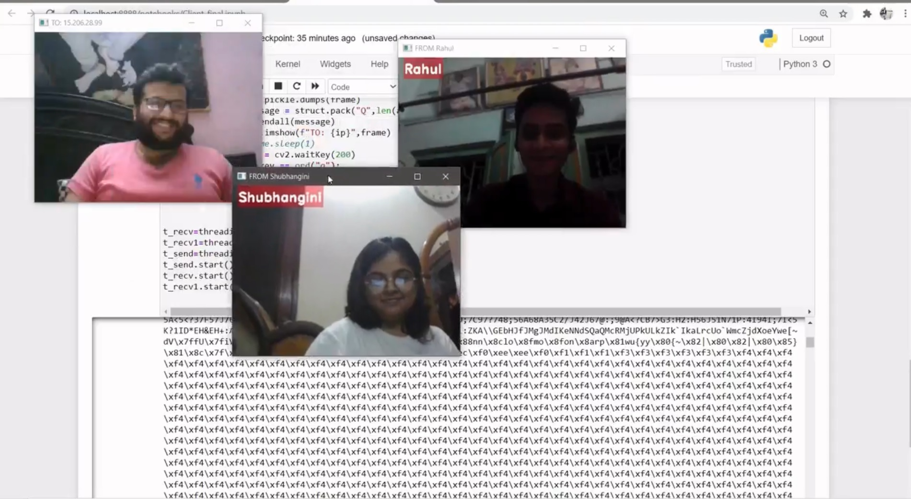

# Video_Chat_Program_without_voice
📌Created a live streaming video chat app without voice using the cv2 module of Python 
📌This is being done by setting up a server on AWS and then creating client-side code implementing socket programming with multithreading
<h4> Demo Picture <h4>

 

 
